# LSPU KMIS System Architecture

## Knowledge Management Information System for Laguna State Polytechnic University

---

## 1. System Overview

The **LSPU Knowledge Management Information System (KMIS)** is a full-stack web application designed to manage institutional documents, track strategic plan progress through QPRO (Quarterly Progress Report on Objectives) analysis, and provide AI-powered semantic search capabilities for the university's knowledge assets.

### 1.1 Technology Stack

| Layer | Technology |
|-------|------------|
| **Frontend** | Next.js 15 (App Router), React 19, TypeScript, Tailwind CSS, shadcn/ui |
| **Backend** | Next.js API Routes, Prisma ORM |
| **Database** | PostgreSQL 16 |
| **Caching** | Redis (Upstash) |
| **File Storage** | Azure Blob Storage |
| **AI/ML Services** | OpenAI GPT-4o-mini, Colivara (Vector Search), Google Gemini |
| **Authentication** | JWT (JSON Web Tokens) |
| **Deployment** | Docker, Docker Compose |

---

## 2. Core System Functions

### 2.1 Document Management

The system provides comprehensive document lifecycle management:

- **Upload & Storage**: Secure file upload with Azure Blob Storage integration
- **Categorization**: Documents organized by category, unit, and metadata tags
- **Version Control**: Document versioning with version notes tracking
- **Access Control**: Permission-based document access (READ/WRITE/ADMIN)
- **Download Tracking**: Analytics for document views and downloads

### 2.2 AI-Powered Semantic Search

Intelligent search functionality using vector embeddings:

- **Colivara Integration**: Document indexing with vector embeddings for semantic search
- **Multi-modal Search**: Supports text and visual content extraction from PDFs/DOCX
- **AI Response Generation**: Natural language responses using GPT-4o-mini/Qwen models
- **Search Caching**: Redis-based caching for improved search performance

### 2.3 QPRO Analysis Engine

Automated analysis of Quarterly Progress Reports aligned with strategic objectives:

- **Document Classification**: AI-powered routing to identify relevant Key Result Areas (KRAs)
- **Activity Extraction**: Automated extraction of activities, achievements, and metrics
- **KPI Tracking**: Progress tracking against Key Performance Indicators
- **Prescriptive Analysis**: AI-generated recommendations for improvement
- **Aggregation Engine**: Consolidation of progress across units and time periods

### 2.4 Role-Based Access Control (RBAC)

Four-tier user hierarchy with granular permissions:

| Role | Level | Access Scope |
|------|-------|--------------|
| **ADMIN** | 4 | Full system access, all units and documents |
| **FACULTY** | 3 | Assigned unit access, document upload/management |
| **STUDENT** | 2 | Read-only access with explicit permissions |
| **EXTERNAL** | 1 | Limited read-only access |

### 2.5 Unit-Based Organization

Organizational structure for multi-department management:

- **Unit Management**: Create and manage organizational units (colleges/departments)
- **Unit Permissions**: Role-based access per organizational unit
- **Document Assignment**: Documents belong to specific units
- **Unit-Scoped Analytics**: Progress tracking per unit

---

## 3. System Architecture Diagram

### 3.1 Layered Architecture Overview

```mermaid
flowchart TB
    subgraph PL["🎨 PRESENTATION LAYER"]
        UI1["📄 Document Management UI"]
        UI2["🔍 Semantic Search UI"]
        UI3["📊 QPRO Analytics Dashboard"]
        UI4["⚙️ Admin Control Panel"]
    end
    
    subgraph AL["🔧 APPLICATION LAYER - Next.js API Routes"]
        AUTH["🔐 JWT Authentication Middleware"]
        API["📡 RESTful API Endpoints"]
    end
    
    subgraph BL["💼 BUSINESS LOGIC LAYER"]
        direction TB
        subgraph QPRO["QPRO Analysis Engine"]
            QR["Reader Model"]
            QE["Extractor Model"]
            QA["Aggregation Service"]
        end
        DS["Document Service"]
        CVS["Colivara Vector Service"]
    end
    
    subgraph ES["🌐 EXTERNAL SERVICES"]
        AI["OpenAI GPT-4o-mini<br/>Google Gemini"]
        BLOB["Azure Blob Storage"]
        COL["Colivara Vector Search API"]
        ORM["Prisma ORM"]
    end
    
    subgraph DL["💾 PERSISTENCE LAYER"]
        DB[("PostgreSQL 16<br/>Database")]
        CACHE[("Redis Cache<br/>Upstash")]
    end
    
    PL --> AL
    AL --> AUTH
    AUTH --> BL
    BL --> QPRO
    BL --> DS
    BL --> CVS
    DS --> BLOB
    DS --> ORM
    CVS --> COL
    QPRO --> AI
    ORM --> DB
    BL --> CACHE
    CVS --> CACHE
```



### 3.2 Layer Breakdown

#### 🎨 Presentation Layer
The user-facing interface built with Next.js 15 and React 19:
- **Document Management UI**: Upload, browse, and manage institutional documents
- **Semantic Search UI**: AI-powered search with natural language queries
- **QPRO Analytics Dashboard**: Visual KPI tracking and progress monitoring
- **Admin Control Panel**: User, unit, and system configuration

#### 🔧 Application Layer
Next.js API routes handling HTTP requests:
- **JWT Authentication Middleware**: Token validation and user session management
- **RESTful API Endpoints**: `/auth`, `/documents`, `/search`, `/qpro`, `/aggregations`

#### 💼 Business Logic Layer
Core services implementing business rules:
- **QPRO Analysis Engine**: Router, Extractor, and Aggregation models
- **Document Service**: CRUD operations and permission checks
- **Colivara Vector Service**: Document indexing and semantic search

#### 🌐 External Services
Third-party integrations:
- **AI Services**: OpenAI GPT-4o-mini and Google Gemini for text generation
- **Azure Blob Storage**: Secure file storage for documents
- **Colivara API**: Vector embeddings and similarity search
- **Prisma ORM**: Type-safe database queries

#### 💾 Persistence Layer
Data storage and caching:
- **PostgreSQL 16**: Primary database for users, documents, units, KPIs
- **Redis (Upstash)**: Caching for search results and session data

---

## 4. Database Schema (Core Entities)

### 4.1 Primary Entities

```
┌──────────────┐       ┌──────────────┐       ┌──────────────┐
│     User     │       │   Document   │       │     Unit     │
├──────────────┤       ├──────────────┤       ├──────────────┤
│ id (UUID)    │       │ id (CUID)    │       │ id (CUID)    │
│ email        │◄──────│ uploadedById │       │ name         │
│ name         │       │ unitId       │──────►│ code         │
│ role (ENUM)  │       │ title        │       │ description  │
│ unitId       │──────►│ fileUrl      │       └──────────────┘
│ password     │       │ category     │
└──────────────┘       │ status       │
                       └──────────────┘
```

### 4.2 QPRO Entities

```
┌──────────────────┐       ┌──────────────────┐       ┌──────────────────┐
│  QPROAnalysis    │       │  KRAggregation   │       │  KPIContribution │
├──────────────────┤       ├──────────────────┤       ├──────────────────┤
│ documentId       │       │ year, quarter    │       │ kra_id           │
│ analysisResult   │       │ kra_id           │       │ initiative_id    │
│ kras (JSON)      │       │ initiative_id    │       │ document_id      │
│ activities (JSON)│       │ target_value     │       │ value            │
│ year, quarter    │       │ achievement_%    │       │ year, quarter    │
│ unitId           │       │ target_type      │       └──────────────────┘
└──────────────────┘       └──────────────────┘
```

---

## 5. Authentication Flow

```
┌────────┐    1. Login Request     ┌────────────┐
│ Client │ ──────────────────────► │  /api/auth │
│        │                         │   /login   │
└────────┘                         └────────────┘
    │                                    │
    │                              2. Verify Password
    │                                    │
    │                                    ▼
    │                            ┌──────────────┐
    │                            │   Database   │
    │                            │  (bcrypt)    │
    │                            └──────────────┘
    │                                    │
    │    3. JWT Access Token             │
    │ ◄──────────────────────────────────┘
    │    + Refresh Token
    │
    ▼
┌────────────┐    4. API Request    ┌────────────┐
│localStorage│ ─────────────────────► │ Protected  │
│ (tokens)   │    Bearer Token      │    API     │
└────────────┘                      └────────────┘
```

**Key Authentication Features:**
- JWT tokens with 1-hour expiration
- Automatic token refresh mechanism
- Session caching in localStorage (5-minute TTL)
- Edge-runtime compatible token verification

---

## 6. QPRO Analysis Workflow

```
┌─────────────────┐
│ Document Upload │
│  (PDF/DOCX)     │
└────────┬────────┘
         │
         ▼
┌─────────────────┐
│  Text Extraction │
│ (pdf2json/mammoth)│
└────────┬────────┘
         │
         ▼
┌─────────────────┐     ┌─────────────────────┐
│  Router Model   │────►│ Strategic Plan JSON │
│ (GPT-4o-mini)   │     │  (KRA Classification)│
└────────┬────────┘     └─────────────────────┘
         │
         ▼
┌─────────────────┐
│ Extractor Model │
│ (Activity/KPI   │
│   Extraction)   │
└────────┬────────┘
         │
         ▼
┌─────────────────┐     ┌─────────────────────┐
│  Aggregation    │────►│  KPIContribution    │
│    Service      │     │  (Audit Trail)      │
└────────┬────────┘     └─────────────────────┘
         │
         ▼
┌─────────────────┐
│   Dashboard     │
│  (Progress View)│
└─────────────────┘
```

**Target Types Supported:**
| Type | Description | Aggregation Method |
|------|-------------|-------------------|
| COUNT | Integer values | Sum all contributions |
| PERCENTAGE/RATE | Decimal 0-100 | Average across units |
| MILESTONE | Binary (0/1) | Checkbox completion |
| FINANCIAL | Currency values | Sum with decimals |
| SNAPSHOT | Point-in-time | Latest value only |

---

## 7. Key API Endpoints

| Endpoint | Method | Description |
|----------|--------|-------------|
| `/api/auth/login` | POST | User authentication |
| `/api/auth/refresh` | POST | Token refresh |
| `/api/documents` | GET/POST | Document CRUD operations |
| `/api/documents/[id]` | GET/DELETE | Single document operations |
| `/api/search` | GET | Semantic search with AI response |
| `/api/qpro/upload` | POST | QPRO document upload & analysis |
| `/api/qpro/analyses` | GET | Retrieve QPRO analyses |
| `/api/aggregations` | GET | KRA/KPI progress aggregation |
| `/api/units` | GET/POST | Unit management |
| `/api/kpi-targets` | GET/PUT | KPI target management |

---

## 8. Security Features

- **Password Hashing**: bcryptjs with salt rounds
- **JWT Authentication**: HMAC-SHA256 signed tokens
- **Role-Based Access**: Hierarchical permission system
- **File Validation**: Type/size restrictions, malware scanning
- **SAS URLs**: Time-limited Azure Blob Storage access
- **Rate Limiting**: Request throttling per user

---

## 9. Deployment Architecture

```
┌─────────────────────────────────────────────────────┐
│                 Docker Compose                       │
│  ┌─────────────┐  ┌─────────────┐  ┌─────────────┐  │
│  │  Next.js    │  │ PostgreSQL  │  │    Redis    │  │
│  │   App       │  │   16-alpine │  │   7-alpine  │  │
│  │  Port 4007  │  │  Port 5432  │  │  Port 6379  │  │
│  └─────────────┘  └─────────────┘  └─────────────┘  │
│                   lspu-network                       │
└─────────────────────────────────────────────────────┘
```

---

## 10. Strategic Plan Integration

The system is built around LSPU's **Strategic Plan (2025-2029)** with:

- **5 Key Result Areas (KRAs)**: Major strategic objectives
- **22 Initiatives/KPIs**: Measurable performance indicators
- **Timeline Targets**: Year-by-year target values
- **Target Scopes**: Institutional vs. Per-Unit tracking
- **Cumulative Tracking**: Support for multi-year cumulative targets

---

*Document Version: 1.0*  
*Last Updated: January 2026*  
*System: LSPU Knowledge Management Information System*
