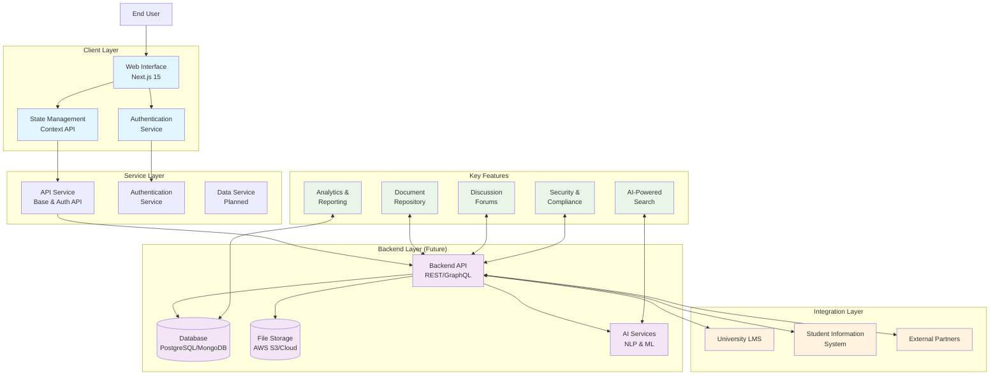
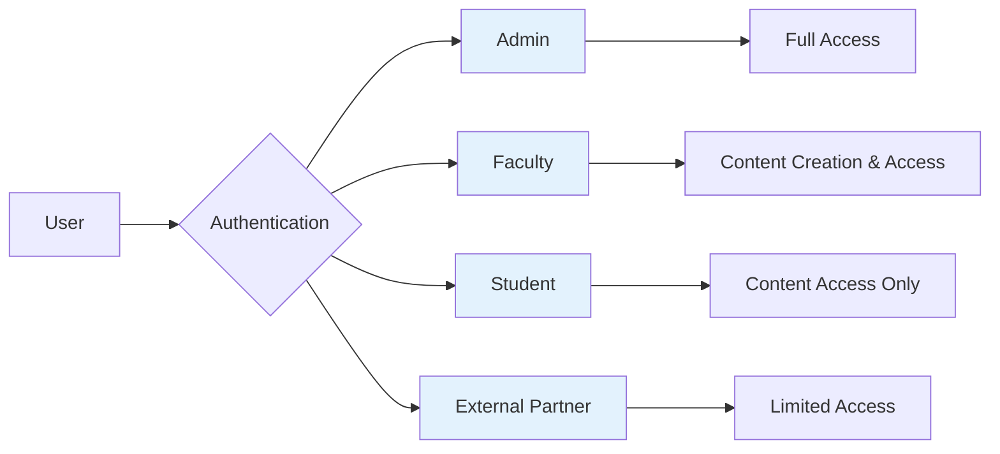
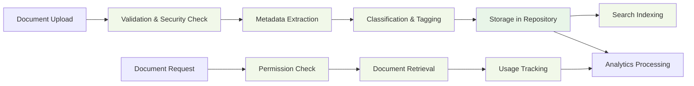
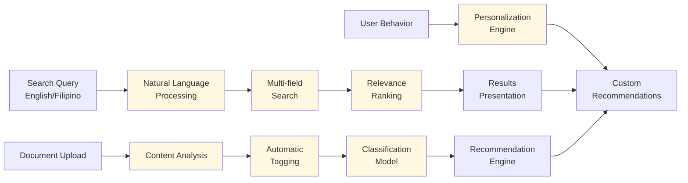

# LSPU KMIS - Refined System Architecture

## High-Level Architecture Diagram

## Core Components Architecture

### 1. User Management & Authentication

### 2. Document Management Flow

### 3. Search & AI Services

## Key Process Flows

### 1. Document Access Process
1. User authenticates through authentication service
2. User requests document from repository
3. System checks user permissions
4. Document is retrieved and delivered
5. Access is logged for analytics

### 2. Search Process
1. User enters search query in English/Filipino
2. NLP processes the query
3. Multi-field search across documents and forums
4. Results ranked by relevance
5. Results displayed with filters

### 3. Content Creation Process
1. Authorized user uploads document
2. System validates file type and security
3. Metadata is extracted and classified
4. Document is stored securely
5. Search index is updated

## Technology Stack

- **Frontend**: Next.js 15, React 19, TypeScript
- **Styling**: Tailwind CSS, shadcn/ui
- **State Management**: React Context API
- **API Communication**: Custom service layer
- **Database**: PostgreSQL/MongoDB (planned)
- **File Storage**: Cloud storage (planned)
- **AI Services**: NLP and ML models (planned)
- **Security**: JWT, RA 10173 compliance